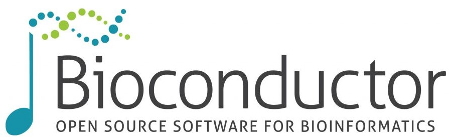

<!-- 

  
<a href="https://microbiome.github.io/" target="_blank">

    
  
</a>

  
<a href="http://ropengov.org/" target="_blank">

    
  
</a>

  
<a href="https://www.bioconductor.org/help/search/index.html?q=Leo+Lahti/" target="_blank">

    
  
</a>

  
<a href="https://www2.helsinki.fi/en/researchgroups/computational-history" target="_blank">

    
  
</a>

  
<a href="/code#ref">

    
  
</a>

  
<a href="https://datadryad.org/search?utf8=%E2%9C%93&q=Leo+Lahti" target="_blank">

    
  
</a>

 -->

  

    
  

  

    

 Statistical and Machine Learning Techniques for Human Microbiome Studies COST action

  

  

    
  

  

    

 Open government data analytics with R. 

  

  

    
  

  

    

 R/Bioconductor projects

      <ul>
        <li>miaverse for microbiome data science</li>
        <li>RPA for short oligonucleotide microarrays</li>
        <li>netresponse for functional network analysis</li>		
      </ul>
    

  

  

    
  

  

    
 
Computational history, with a focus on Europen knowledge production in early modern era
 

  

  

    
  

  

    

      <h3>Data</h3>
      <h4>Microbiome research</h4>
      Various data sets related to publications available in the following
      open repositories:
    <a href="https://datadryad.org/search?utf8=%E2%9C%93&q=Leo+Lahti">Data Dryad</a>
    <a href="https://figshare.com/search?q=Leo+Lahti">Figshare</a>
    <a href="https://microbiome.github.io">Github</a>    
    

  

# Open research data and software

### Statistical ecology and machine learning

**[Microbiome bioinformatics software and tutorials](http://microbiome.github.io)**

**[DMT](http://dmt.r-forge.r-project.org)** Dependency Modeling Toolkit. Probabilistic tools for dependency analysis between multiple data sources (R/CRAN). Probabilistic PCA, factor analysis, CCA, regularized variants, dependency-based dimensionality reduction etc. _ICML/MLOSS workshop, Israel 2010_.

<!--**[earlywarnings](http://www.early-warning-signals.org/)** Methods for identification of critical transitions between ecosystem states from time series data (CRAN). Co-developer. [CRAN](http://cran.r-project.org/web/packages/earlywarnings/index.html)/[Github](https://github.com/earlywarningtoolbox/earlywarnings-R/tree/master/earlywarnings). _WICI Data Challenge 2013 runner-up / Waterloo Institute for Complex Systems and Innovation._-->

### Bioinformatics

**[netresponse](http://bioconductor.org/packages/release/bioc/html/netresponse.html)** Modeling context-specific activation patterns in genome-wide interaction networks (R/Matlab). Originally applied to study transcriptional responses in genome-scale interaction networks across organism-wide collections of gene expression data. [doi:10.18129/B9.BIOC.NETRESPONSE](https://doi.org/10.18129/B9.BIOC.NETRESPONSE)

**[RPA](http://bioconductor.org/packages/release/bioc/html/RPA.html)** (R/Bioconductor). Scalable probabilistic method for preprocessing short oligo microarray data. [_NAR_ 2013](http://nar.oxfordjournals.org/content/early/2013/04/05/nar.gkt229.abstract). [doi:10.18129/B9.BIOC.RPA](https://doi.org/10.18129/B9.BIOC.RPA)

**[intcomp](http://intcomp.r-forge.r-project.org)** Benchmarking for integrative cancer gene discovery algorithms. [_Briefings in Bioinformatics_ 2012](http://bib.oxfordjournals.org/content/early/2012/03/21/bib.bbs005.abstract)

**[pint](https://github.com/antagomir/pint)** Probabilistic data integration for DNA/RNA data in functional genomics (R/Bioc). [_MLSP_ 2009](http://arxiv.org/abs/1101.5919).

### Digital Humanities and Computational Social Science

**[rOpenGov](https://ropengov.org)** R package ecosystem for open government data analytics (R/GitHub). introduced in NIPS Machine Learning Open Source Software workshop 2013.

**[COMHIS](http://helsinki.fi/computational-history)** Helsinki Computational History Group data analytics infrastructure.

### Academic publishing

[Full agreement texts for academic publisher agreements](http://finelib.fi/negotiations/negotiations/). The agreements were released by the FinELib consortium of research libraries following our FOI request in April 2018.

[Scientific journal subscription costs in Finland 2010-2017; MoE/ATT](http://ropengov.github.io/r/2018/12/05/FOI/). The data set was released by Finnish Ministry of Education (Open Science and Research Initiative) following my Freedom of Information Request ([summary](http://ropengov.github.io/r/2016/06/10/FOI/)). Finland became the first country to systematically collect and release this information.

