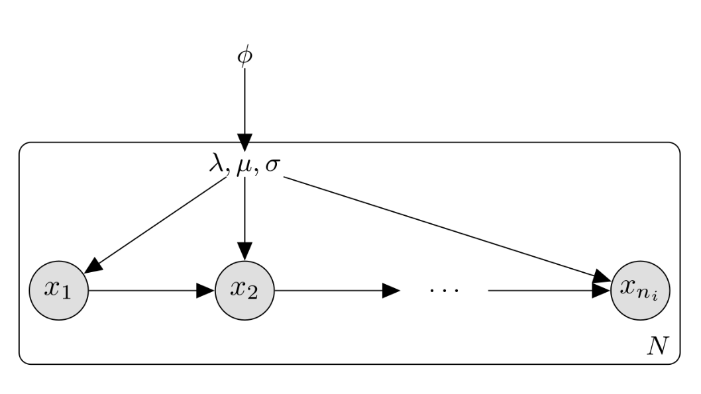

<link href="/css/style.research.css" rel="stylesheet">

  

Research topics
===============

**Our research focuses on computational analysis and understanding of complex natural and social systems.** There is a great demand for targeted computational techniques to extract information and insights from rich data collections based on clever combinations of human and machine intelligence. We blend elements from fields such as machine learning/AI, probabilistic programming, statistical ecology, and data science, and drive open developer communities that help to translate latest theoretical advances into accessible methods to inform modeling, experimentation, and decision-making. **Key applications** include microbiome research, population cohort studies, and computational social sciences and humanities (SSH). We also coordinate the [Open Knowledge Finland Open Science work group](https://fi.okfn.org/wg/openscience/), which received **Open Science and Research award of the Ministry of Education and Culture in 2017**.

 

For more information about our different research topics : 
-------
 

<!--
INFO: How to use bibliography shortcodes

You can... 

output the whole bibliography with


individual items by id with


items by keywords with


...to your .md page. (DOES NOT WORK ON .HTML TEMPLATES)
-->

- [**All publications**](/research/all)  
 ---------------

- [**Microbiome data science**](/research/microbiome-data-science)  
 ---------------

- [**Computational humanities**](/research/computational-humanities)  
---------------

- [**Computational and data science**](/research/computational-and-data-science)  
---------------

- [**Open science**](/research/open-science)  
 ---------------

- [**Preprints**](/research/preprints)  
 ---------------

- [**Opinion pieces (in Finnish)**](/research/opinion-pieces)  
 ---------------

- [**Funding and support**](/research/funding-and-support)  

  

    
    <figcaption class="caption"> Figure by: Ville Laitinen & Leo Lahti </figcaption>
  

