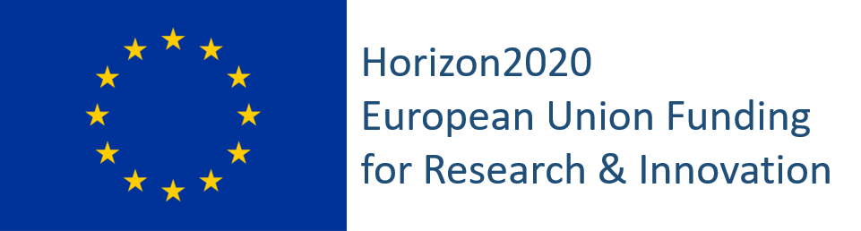
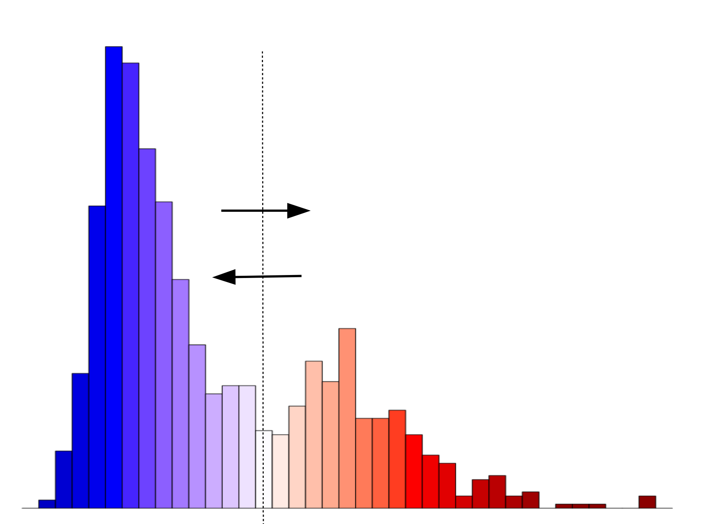
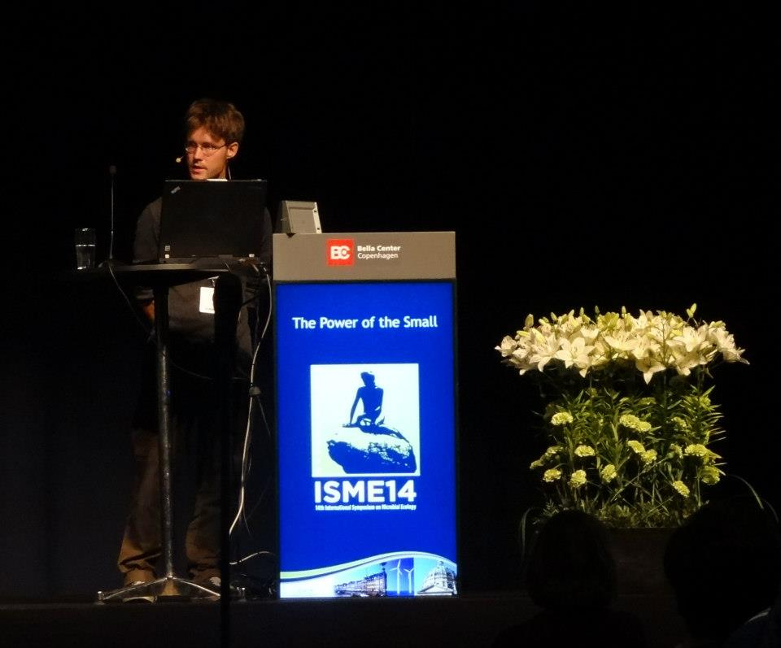

# Research topics

**Our research focuses on computational analysis and understanding of
complex natural and social systems.** There is a great demand for
targeted computational techniques to extract information and insights
from rich data collections based on clever combinations of human and
machine intelligence. We blend elements from fields such as machine
learning/AI, probabilistic programming, statistical ecology, and data
science, and drive open developer communities that help to translate
latest theoretical advances into accessible methods to inform
modeling, experimentation, and decision-making.

**Key applications** include microbiome research, population cohort
studies, and computational social sciences and humanities (SSH). We
also coordinate the [Open Knowledge Finland Open Science work
group](https://fi.okfn.org/wg/openscience/), which received **Open
Science and Research award of the Ministry of Education and Culture in
2017**.

## Recent publications

<!--See [Google scholar](https://scholar.google.co.uk/citations?user=mjjV-AoAAAAJ&hl=fi&oi=ao).-->

Below some examples from recent publications.
See [ORCID](http://orcid.org/0000-0001-5537-637X) for a full list. 
Full publication list is also available as [bibtex](https://github.com/openresearchlabs/openresearchlabs.github.io/blob/master/content/publication_resources/bibtex/lahti.bib).
Copies of most papers are available [here](https://github.com/openresearchlabs/openresearchlabs.github.io/tree/master/content/publication_resources).

### Computational and data science

[**Wrangling with Non-Standard Data**](http://ceur-ws.org/Vol-2612/paper6.pdf)  
Proc. Digital Humanities in the Nordic Countries 2020.  
Mäkelä E, Lagus K, Lahti L, Säily T, Tolonen M, Hämäläinen M, Kaislaniemi S, Nevalainen T.  
Best long paper in DHN2020.

[**Three-species Lotka-Volterra model with respect to Caputo and Caputo-Fabrizio fractional operators**](https://doi.org/10.3390/sym13030368)  
Symmetry 2021.  
Khalighi M, Eftekhari L, Hosseinpour S, Lahti L.

[**A hierarchical Ornstein-Uhlenbeck model for stochastic time series analysis**](https://link.springer.com/chapter/10.1007/978-3-030-01768-2_16)  
Advances in Intelligent Data Analysis XVII. Lecture Notes in Computer Science 11191. Springer, 2018.  
Laitinen V, Lahti L

[**Retrieval and analysis of Eurostat open data with the eurostat R package**](https://journal.r-project.org/archive/2017/RJ-2017-019/index.html)  
R Journal, 2017.  
Lahti L, Huovari J, Kainu M, Biecek P.

[**Open Data Science**](https://github.com/openresearchlabs/openresearchlabs.github.io/blob/master/content/publication_resources/papers/2018-Lahti-IDA.pdf)  
Advances in Intelligent Data Analysis XVII. Lecture Notes in Computer Science 11191:31-39. Springer, India, 2018.  
Lahti L.

### Microbiome data science

[**Taxonomic Signatures of Long-Term Mortality Risk in Human Gut Microbiota**](https://doi.org/10.1101/2019.12.30.1901584)  
Preprint at medRxiv 2019.12.30.19015842.  
Salosensaari A*, Laitinen V*, Havulinna A, Meric G, Cheng S, Perola M, Valsta L, Alfthan G, Inouye M, Watrous JD, Long T, Salido R, Sanders K, Brennan C, Humphrey GC, Sanders JG, Jain M, Jousilahti P, Salomaa V, Knight R, Lahti L, Niiranen T.  

[**Statistical and machine learning techniques in human microbiome studies: contemporary challenges and solutions**](https://doi.org/10.3389/fmicb.2021.635781)  
Frontiers in Microbiology 2021. 
Moreno-Indias I, Lahti L, Nedyalkova M, Elbere I, Roshchupkin GV, Adilovic M, Aydemir O, Bakir-Gungor B, Carrillo-de Santa Pau E, D'Elia D, Desai MS, Falquet L, Gundogdu A, Hron K, Klammsteiner T, Lopes MB, Marcos Zambrano LJ, Marques C, Mason M, May P, Pašić L, Pio G, Pongor S, Promponas VJ, Przymus P, Sáez-Rodríguez J, Sampri A, Shigdel R, Stres B, Suharoschi R, Truu J, Truică C-O, Vilne B, Vlachakis DP, Yılmaz E, Zeller G, Zomer A, Gómez-Cabrero D, Claesson M.

[**Links between gut microbiome composition and fatty liver disease in a large population sample**]()  
Gut Microbes 2021. In press.
Ruuskanen MO, Åberg F, Männistö V, Havulinna AS, Méric G, Liu Y, Loomba R, Vázquez-Baeza Y, Tripathi A, Valsta LM, Inouye M, Jousilahti P, Salomaa V, Jain M, Knight R, Lahti L, Niiranen TJ. 

[**Microbial communities as dynamical systems**](https://doi.org/10.1016/j.mib.2018.07.004)  
Current Opinion in Microbiology 2018.  
Gonze D, Coyte KZ, Lahti L, Faust K.

[**Signatures of ecological processes in microbial community time series**](https://doi.org/10.1186/s40168-018-0496-2)  
Microbiome, 2018.    
Faust K, Bauchinger F, Laroche B, de Buyl S, Lahti L, Washburne AD, Gonze D, Widder S.

[**Multi-stability and the origin of microbial community types**](https://doi.org/10.1038/ismej.2017.60)  
ISME Journal 2017.  
Faust K, Gonze D, Lahti L, Raes J.

[**Linking statistical and ecological theory: Hubbell's unified neutral theory of biodiversity as a hierarchical Dirichlet process**](https://doi.org/10.1109/JPROC.2015.2428213)  
Proceedings of the IEEE 2017.  
Harris K, Parsons TL, Ijaz UZ, Lahti L, Holmes I, Quince C.

    

       
### Computational humanities

[**Quantifying bias and uncertainty in historical data collections with probabilistic programming**](http://ceur-ws.org/Vol-2723/short46.pdf)  
CEUR Workshop Proc. on Computational Humanities Research, 2020.  
Lahti L, Mäkelä E, Tolonen M.

[**Bibliographic Data Science and the History of the Book (c. 1500-1800)**](https://doi.org/10.1080/01639374.2018.1543747)  
Cataloging and classification quarterly, 2019.  
Lahti L, Marjanen J, Roivainen H, Tolonen M.  

[**A Quantitative Approach to Book-Printing in Sweden and Finland, 1640–1828**](https://doi.org/10.1080/01615440.2018.1526657)  
Historical Methods: A Journal of Quantitative and Interdisciplinary History, 2019.  
Tolonen M*, Lahti L*, Roivainen H, Marjanen J.

[**A National Public Sphere? Analyzing the Language, Location, and Form of Newspapers in Finland, 1771–1917**](https://doi.org/10.21825/jeps.v4i1.10483 )  
Journal of European Periodical Studies, 2019.  
Marjanen J, Vaara V, Kanner A, Roivainen H, Mäkelä E, Lahti L, Tolonen M.

### Open science

[**Alchemy & algorithms: perspectives on the philosophy and history of open science**](https://doi.org/10.3897/rio.3.e13593)  
RIO Journal 2017.  
Lahti L, da Silva F, Laine MP, Lähteenoja V, Tolonen M.

[**Open education and educational resources. National policy and executive plan by the higher education and research community for 2021-2025 - Policy component 1: Open access to educational resources**](https://doi.org/10.23847/isbn.9789525995251)  
Responsible Research Series 16:2020. Helsinki, Finland.
Published by the Committee for Public Information (TJNK)   and Federation of Finnish Learned Societies (TSV)  .

[**Open Research Policy / Avoimen tutkimuksen politiikka**](https://www.utu.fi/sites/default/files/public%3A//media/file/avoimen-tutkimuksen-politiikka-en.pdf)  
University of Turku, OpenUTU work group, 2018.  

[**Opening academic publishing: development and application of systematic evaluation criteria. Report on the openness of major scientific publishers**](http://urn.fi/URN:NBN:fi-fe201802123334)  
Finnish IT Center for Science (CSC)   and Ministry of Education and Culture, Open Science and Research Initiative (ATT). 2018.   
Björk A, Paavolainen J-M, Ropponen T, Laakso M, Lahti L.

### Opinion pieces (in Finnish)  

[**Aatehistoria ja digitaalisten aineistojen mahdollisuudet**](https://www.ennenjanyt.net/2015/08/aatehistoria-ja-digitaalisten-aineistojen-mahdollisuudet/)  
Ennen & Nyt (Finland) 2015.  
Tolonen M, Lahti L.

[**Avoimuus voi vahvistaa päätöksenteon tieteellistä pohjaa**](https://blogs.helsinki.fi/thinkopen/lahdekoodin-avoimuus-paatoksenteossa/)  
Invited opinion piece: University of Helsinki, ThinkOpen blog. August 2020.  
Lahti L.

[**Päätös epidemialaskelmien salaamisesta vastoin valtioneuvoston avoimuuslinjausta**](https://www.okf.fi/fi/2020/06/15/thln-paatos-epidemialaskelmien-salaamisesta-vastoin-valtioneuvoston-avoimuuslinjausta/)  
Invited perspective, Open Knowledge Finland blog. July 2020.  
Lahti L.

[**Lähdekoodin sisältämien yksityiskohtien avoimuus on keskeistä päätöksenteon läpinäkyvyydelle**](https://www.hs.fi/mielipide/art-2000006545770.html)  
HS Mielipide. June 2020.  
Lahti L.

[**Tietopyyntö THL:n epidemialaskelmien lähdekoodeista**](https://www.okf.fi/fi/2020/05/13/tietopyynto-thln-epidemialaskelmien-lahdekoodeista/)  
Open Knowledge Finland ry. (Freedom of Information request)  
Invited perspective, Open Knowledge Finland blog. June 2020.  
Lahti L, Toikkanen T.

[**Päätöksenteossa käytettävien laskentamallien tulisi olla lähtökohtaisesti avoimia**](https://www.hs.fi/mielipide/art-2000006494641.html)  
Helsingin Sanomat (HS Mielipide / researcher position statement). May 2020.  
Lahti L, Wallgren T, Kulmala M.

### Funding and support

The work has been supported by University of Turku, Academy of
Finland, European Union (COST / H2020), foundations, and other
sources.

     

<!--  -->

<!--

**Functional genomics** Mapping of the three billion base-pair human
genome sequence in 2001 was the first step towards uncovering the
dynamic and contextual functional properties of the
genome. Understanding functional organization of genetic information
and its regulation through transcriptional, epigenetic, and other
mechanisms remains a key challenge for human biology. We have done
research in cancer studies, large gene expression databases, and
multi-omics data integration.  <!--In the thesis work, I developed
open source machine learning algorithms for data integration in
functional genomics.  For more details, check the [list of
publications](/work/pubs) and the [PhD
thesis](http://lib.tkk.fi/Diss/2010/isbn9789526033686).--> 

<!--

such as human microbiome, experimental ecology and
evolution, history of knowledge production in western societies, and
open research software for social sciences and humanities (SSH)
research.

-->

<!--

### Highlights

[rOpenGov](https://ropengov.org) developer network and

We develop theory, methods and applications of modern statistical data analysis.

We have
advocated open science, and some highlights include a [report on the
openness of academic
publishers](https://openscience.fi/-/openness-of-academic-publishers-evaluated-for-the-first-time),
commissioned by Finnish Ministry of Education and Culture; [opening of
several agreements with academic publishers in
2017-2019](http://finelib.fi/finelib-agreements-published/) and
[opening of scientific journal subscription costs in Finland
2010-2017](https://fi.okfn.org/2018/08/27/finland-remains-a-leading-country-in-the-transparency-of-academic-publishing-costs)
following our FOI requests. 

We collaborate actively with applied research teams, such as
[Helsinki Computational History (COMHIS)
Group](https://www.helsinki.fi/en/researchgroups/computational-history)
to model and analysed the history of knowledge production following
the emergence of print press in the fifteenth century.

-->

<!-- (see a [poster in Digital
Humanities
2019](https://www.helsinki.fi/en/researchgroups/computational-history/dh2019-poster)). -->

<!--

**Key collaborators**

- [Jeroen Raes Lab](http://www.raeslab.org/) at VIB/KU Leuven on bioinformatics and ecosystems< biology.
- [Prof Willem de Vos](https://tuhat.helsinki.fi/portal/fi/person/wdevos) Helsinki/Wageningen; human gut microbial ecology. 
- Prof Mikko Tolonen. I am an active and founding member of [Helsinki Computational History Group](http://comhis.github.io/)
-->