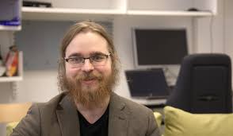
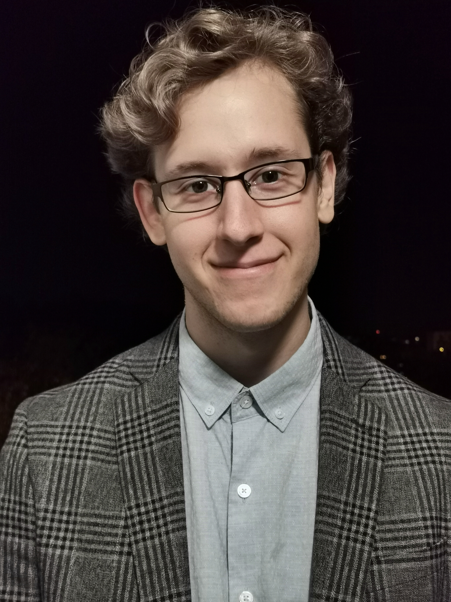

# Research team

**Welcome to [contact us](../contact/) to discuss research/study positions and collaboration.** 

  
 
   

<!--    -->
  
  

  <h4>Leo Lahti (Group leader)</h4>

  <ul style="overflow: hidden">
  <li>Associate Professor (Data Science)</li>
  <li>Academy of Finland Research Fellow 2016-2021</li>
  <li>Director, Turku Center for Computational Humanities</li>
  <li><a href="https://tenk.fi/en/research-misconduct/research-integrity-advisers">National Board on Research Integrity (TENK)</a> research integrity adviser</li>
  <li> <a href="https://avointiede.fi/fi/koordinaatio">National open science coordination</a> steering group</li> 
  <li> <a href="http://www.tkts.fi/etusivu">Finnish Society for Computer Science</a> board</li> 
  <li><a href="https://turkucitydata.fi">Turku City Data Co.</a> Board member and scientific advisor.</li>  
  <li><a href="https://blueprintgenetics.com">Blueprint Genetics</a>. Scientific Advisor (AI & ML)</li>
  <li><a href="http://www.helsinki.fi/computational-history">Helsinki Computational History Group</a> founding member</li>      
  <li><a href="http://fi.okfn.org/wg/openscience/">Open Science work group</a>, OKF Finland. Founding member.</li>

  <li><a href="http://orcid.org/0000-0001-5537-637X">ORCID: 0000-0001-5537-637X</a>;
<a href="http://www.researcherid.com/rid/G-3170-2010">ResearcherID: G-3170-2010</a>;
<a href="https://tinyurl.com/ng6g6tk">Google Scholar</a>;
<a href="https://www.scopus.com/authid/detail.uri?authorId=8679063700">Scopus</a>;
<a href="http://www.researchgate.net/profile/Leo_Lahti/">ResearchGate</a>;
<a href="https://publons.com/author/246930/leo-lahti#stats">Publon</a>;
<a href="https://impactstory.org/u/0000-0001-5537-637X">ImpactStory</a>;
<a href="http://depsy.org/person/333684">Depsy software impact</a>; 
<a href="http://loop.frontiersin.org/people/295152/overview">Loop</a>; 
<a href="https://www.scienceopen.com/user/statistics/leo_lahti">ScienceOpen</a>;
<a href="http://www.ncbi.nlm.nih.gov/sites/myncbi/collections/public/1VaRtFbzqhfLWsXzDa1c5CSQK">PubMed</a>; 
<li><a href="../contact">Contact information</a> for the research team</li> 
<li><a href="https://twitter.com/antagomir">Twitter / @antagomir</a> personal account</li>
<li><a href="pgp_lahti_pm.asc">PGP key</a>

</ul>

## Postdocs

Matti Ruuskanen             |  Guilhem Sommeria-Klein | [Pande Erawijantari](https://erawijantari.github.io) | Aura Raulo |
:-------------------------:|:-------------------------:|:-------------------------:|:-------------------------:|
  |   |   |  |

    
## PhD candidates

The affiliation for the co-supervised PhD candidates indicated in parentheses.

| Ville Laitinen | [Moein Khalighi](https://scholar.google.com/citations?user=XrlaLlUAAAAJ&hl=en) | Iiro Tiihonen (COMHIS) | Ville Vaara (COMHIS) |
|:-------------------------:|:-------------------------:|:-------------------------:|:-------------------------:|
 |  |  |  |

-------------------------

| Joonatan Palmu (THC) | Felix Vaura (THC) | Henrik Eckerman (Nijmegen) | Mrunalini Lotankar (VaMiPre) | Anna Sorjamaa (Oulu) | 
|:-------------------------:|:-------------------------:|:-------------------------:|:-------------------------:|:-------------------------:|
 |  |  |  |  | 

-------------------------

## Research assistants

| Pyry Kantanen | Chandler Ross | Tuomas Borman | Julia Matveeva | Renuka Potbhare (Pune) | 
|:-------------------------:|:-------------------------:|:-------------------------:|:-------------------------:|:-------------------------:|
 |  |  |  |  |

## Alumni

Anna Aatsinki (2019-2021) | Wisam Saleem (2019-2020) | Prashant Gaikwad (2019) | Aaro Salosensaari (2019-2020) | Anastasia Karavaeva (2019) | Tim Garrels (2020) | Hege Roivainen (2016-2020) | Binu Matthew (2019-2020)
 

