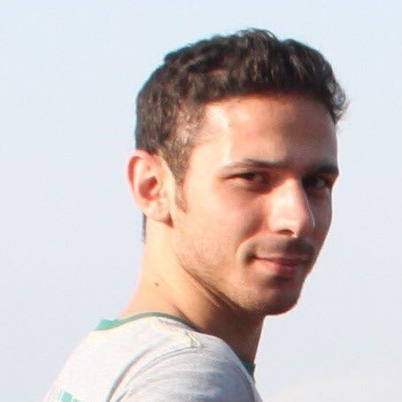
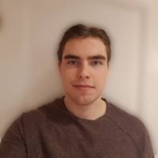

# Research team

**Welcome to [contact us](../contact/) to discuss research/study positions and collaboration.** 

  
 
     
  

<!--    -->
  
  <h4>Leo Lahti (Group leader)</h4>

  <ul style="overflow: hidden">
    <li>Associate Professor (Data Science)</li>
    <li>Academy of Finland Research Fellow 2016-2021</li>
    <li>Director, Turku Center for Computational Humanities</li>
    <li><a href="https://tenk.fi/en/research-misconduct/research-integrity-advisers">National Board on Research Integrity (TENK)</a> research integrity adviser</li>
    <li> <a href="https://avointiede.fi/fi/koordinaatio">National open science coordination</a> steering group</li> 
    <li> <a href="http://www.tkts.fi/etusivu">Finnish Society for Computer Science</a> board</li> 
    <li><a href="https://turkucitydata.fi">Turku City Data Co.</a> Board member and scientific advisor.</li>  
    <li><a href="https://blueprintgenetics.com">Blueprint Genetics</a>. Scientific Advisor (AI & ML)</li>
    <li><a href="http://www.helsinki.fi/computational-history">Helsinki Computational History Group</a> founding member</li>      
    <li><a href="http://fi.okfn.org/wg/openscience/">Open Science work group</a>, OKF Finland. Founding member.</li>
    <li>
      <a href="http://orcid.org/0000-0001-5537-637X">ORCID: 0000-0001-5537-637X</a>;
      <a href="http://www.researcherid.com/rid/G-3170-2010">ResearcherID: G-3170-2010</a>;
      <a href="https://tinyurl.com/ng6g6tk">Google Scholar</a>;
      <a href="https://www.scopus.com/authid/detail.uri?authorId=8679063700">Scopus</a>;
      <a href="http://www.researchgate.net/profile/Leo_Lahti/">ResearchGate</a>;
      <a href="https://publons.com/author/246930/leo-lahti#stats">Publon</a>;
      <a href="https://impactstory.org/u/0000-0001-5537-637X">ImpactStory</a>;
      <a href="http://depsy.org/person/333684">Depsy software impact</a>; 
      <a href="http://loop.frontiersin.org/people/295152/overview">Loop</a>; 
      <a href="https://www.scienceopen.com/user/statistics/leo_lahti">ScienceOpen</a>;
      <a href="http://www.ncbi.nlm.nih.gov/sites/myncbi/collections/public/1VaRtFbzqhfLWsXzDa1c5CSQK">PubMed</a>; 
    </li>
    <li><a href="../contact">Contact information</a> for the research team</li> 
    <li><a href="https://twitter.com/antagomir">Twitter / @antagomir</a> personal account</li>
    <li><a href="pgp_lahti_pm.asc">PGP key</a>
  </ul>
 

## Postdocs

 

  

  

  

  

  
  
 Matti Ruuskanen 

  
 Guilhem Sommeria-Klein 

  
Pande Erawijantari 

  
 Aura Raulo 

  
 Microbial ecology, bioinformatics, human microbiomes, environmental change. 

  

  
 Human microbiome, metagenomic, metabolomic,  microbial ecology, bioinformatics. 

  
 

  

  

  

  

  

## PhD candidates

The affiliation for the co-supervised PhD candidates indicated in parentheses.

 

  

  

  

  

  

  
  
 Ville Laitinen 

  
 Moein Khalighi 

  
 Chandler Ross 

  
 Iiro Tiihonen (COMHIS) 

  
 Ville Vaara (COMHIS) 

  
 Probabilistic modeling, time series, early warning signals. 

  
 Ecological Memory, Fractional Calculus, Differential Equations, Dynamic Modelling, Data Analysis. 

  
 Eco-Evolutionary Dynamics, Statistical Modelling, Time Series. 

  
 

  
 

  

  

  

  

  

-------------------------

  

  

  

  

  

  
  
 Joonatan Palmu (THC) 

  
 Felix Vaura (THC) 

  
 Henrik Eckerman (Nijmegen) 

  
 Mrunalini Lotankar (VaMiPre) 

  
 Anna Sorjamaa (Oulu) 

  
 

  

  
 

  
 

  
 

  

  

  

  

  

  
## Research assistants

  

  

  

  

  
  
 Pyry Kantanen 

  
 Tuomas Borman 

  
 Julia Matveeva 

  
 Renuka Potbhare (Pune) 

  
 R programming, Open data, Social research 

  
 Bioinformatics, Human microbiome, R package development 

  
 

  
 

  

  

  

  

  

## Alumni

Co-supervised PhDs:

- Anna Aatsinki (University of Turku, 2021; with Finnbrain)
- Sudarshan Shetty (Wageningen University, 2019; with Willem M de Vos)

Research assistants:

- Tim Garrels (2020; BARI internship)
- Hege Roivainen (2016-2020; at Helsinki Computational History Group)
- Aaro Salosensaari (2019-2020)
- Binu Matthew (2019-2020)
- Prashant Gaikwad (2019; SPARC / supported by Government of India)

MSc students:

- Emma Gheysen (KU Leuven, BE 2021; with Prof. Karoline Faust)
- Anastasia Karavaeva (2020)
- Wisam Saleem (2019-2020)
- Leila Paquay (KU Leuven, Belgium, 2018)

