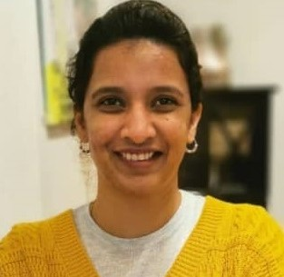
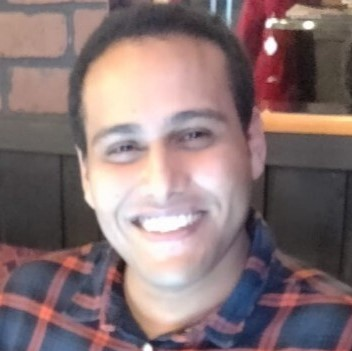

# Research team

**Welcome to [contact us](../contact/) to discuss research/study positions and collaboration.** 

  
 
     
    

      
      
            
           
      
      
      
    

  

<!--    -->
  
  <h4>Leo Lahti (Group leader)</h4>

  <ul style="overflow: hidden">
    <li><a href="https://www.utu.fi/en/people/leo-lahti">Associate Professor (Data Science)</a></li>
    <!--<li>Academy of Finland Research Fellow 2016-2021</li>-->
    <li>Director, Turku Center for Computational Humanities</li>
    <li><a href="https://tenk.fi/en/research-misconduct/research-integrity-advisers">National Board on Research Integrity (TENK)</a> research integrity adviser</li>
    <li> <a href="https://avointiede.fi/fi/koordinaatio">National open science coordination</a> steering group</li> 
    <li> <a href="http://www.tkts.fi/etusivu">Finnish Society for Computer Science</a> board</li> 
    <li><a href="https://turkucitydata.fi">Turku City Data Co.</a> Board member and scientific advisor.</li>  
    <li><a href="https://blueprintgenetics.com">Blueprint Genetics</a>. Scientific Advisor (AI & ML)</li>
    <li><a href="http://www.helsinki.fi/computational-history">Helsinki Computational History Group</a> founding member</li>      
    <li><a href="http://fi.okfn.org/wg/openscience/">Open Science work group</a>, OKF Finland. Founding member.</li>
    <li><a href="../bio_lahti">Biography</a></li>    
  </ul>

## Postdocs

 

<ul class="flex-container">
  <li class="flex-item">
    

    
Matti Ruuskanen

    
Microbial ecology, bioinformatics, human microbiomes, environmental change.

  </li>
  <li class="flex-item">
    

    
Guilhem Sommeria-Klein

    
Statistical ecology, probabilistic models, microbiomes.

    

  </li>
  <li class="flex-item">
    

    
Pande Erawijantari

    
Human microbiome, metagenomic, metabolomic, microbial ecology, bioinformatics.

    

  </li>
  <li class="flex-item">
    

    
Aura Raulo

    
Microbiomes, ecology.

    

  </li>
  <li class="flex-item">
    

    
Pande Erawijantari

    
Metagenomics, bioinformatics, AMR.

    

  </li>
</ul>

## PhD candidates

The affiliation for the co-supervised PhD candidates indicated in parentheses.

 

<ul class="flex-container">
  <li class="flex-item">
    

    
Ville Laitinen

    
Probabilistic modeling, time series, early warning signals.

    

  </li>
  
  <li class="flex-item">
    

    
Moein Khalighi

    
Ecological Memory, Fractional Calculus, Differential Equations, Dynamic Modelling, Data Analysis.

    

    
    

  </li>
  
  <li class="flex-item">
    

    
Chandler Ross

    
Eco-Evolutionary Dynamics, Statistical Modelling, Time Series.

    

  </li>
  
</ul>

  
## PhD candidates, co-supervised

<ul class="flex-container">

  <li class="flex-item">
    

    
Iiro Tiihonen (<a href="https://www2.helsinki.fi/en/researchgroups/computational-history" target="_blank">COMHIS</a>)

    
Computational history, probabilistic modeling.

    

    

  </li>
  
  <li class="flex-item">
    

    
Ville Vaara (<a href="https://www2.helsinki.fi/en/researchgroups/computational-history" target="_blank">COMHIS</a>)

    
Computational history, digital humanities.

    

  </li>
  
  <li class="flex-item">
    

    
Joonatan Palmu (<a href="https://www.hypertensioncenter.org/" target="_blank">THC</a>)

    
Data science, bioinformatics.

    

  </li>
  
  <li class="flex-item">
    

    
Felix Vaura (<a href="https://www.hypertensioncenter.org/" target="_blank">THC</a>)

    
Data science, bioinformatics.

    

  </li>
</ul>

<ul class="flex-container">

  <li class="flex-item">
    

    
Henrik Eckerman (<a href="https://dpblab.org/" target="_blank">Nijmegen</a>)

    
Human microbiome and health, bioinformatics.

    

    

  </li>
  
  <li class="flex-item">
    

    
Mrunalini Lotankar (FOPP)

    
Bioinformatics, human microbiome, metagenomic, metabolomic.

    

    
  </li>
  
  <li class="flex-item">
    

    
Anna Sorjamaa (Oulu)

    
Microbiomes, bioinformatics.

    

  </li>
  
</ul>

  
## Research assistants

<ul class="flex-container">
  <li class="flex-item">
    

    
Pyry Kantanen

    
R programming, Open data, Social research.

    

  </li>
  
  <li class="flex-item">
    

    
Tuomas Borman

    
Bioinformatics, Human microbiome, R package development.

    

  </li>
  
  <li class="flex-item">
    

    
Renuka Potbhare (Pune)

    
Human skin microbiome, metagenomics, bioinformatics.

    

  </li>
  
  <li class="flex-item">
    

    
Chouaib Benchraka

    
Machine Learning, data Science.

    

  </li>

</ul>

<ul class="flex-container">
  <li class="flex-item">
    

    
Julia Matveeva

    
 Digital humanities. 

    

  </li>
  
  <li class="flex-item">
    

    
 Yagmur Simsekk 

    
Data Science.

    

    
  </li>

  <li class="flex-item">
    

    
 Giulio Benedetti 

    
Data Science.

    

    
  </li>

</ul>

  

## Alumni

Co-supervised PhDs:

- Anna Aatsinki (University of Turku, 2021; with <a href="https://sites.utu.fi/finnbrain/en/" target="_blank">Finnbrain</a>)
- Sudarshan Shetty (Wageningen University, 2019; with Willem M de Vos)

Research assistants:

- Tom Gobardhan (2021; summer intern)
- Tim Garrels (2020; BARI internship)
- Hege Roivainen (2016-2020; at Helsinki Computational History Group)
- Aaro Salosensaari (2019-2020)
- Binu Mathew (2019-2020)
- Prashant Gaikwad (2019; SPARC / supported by Government of India)

MSc students:

- Emma Gheysen (KU Leuven, BE 2021; with Prof. Karoline Faust)
- Anastasia Karavaeva (2020)
- Wisam Saleem (2019-2020)
- Leila Paquay (KU Leuven, Belgium, 2018)

